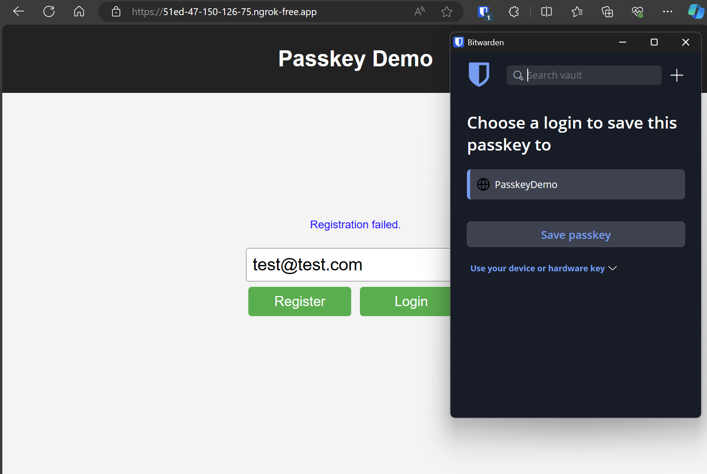
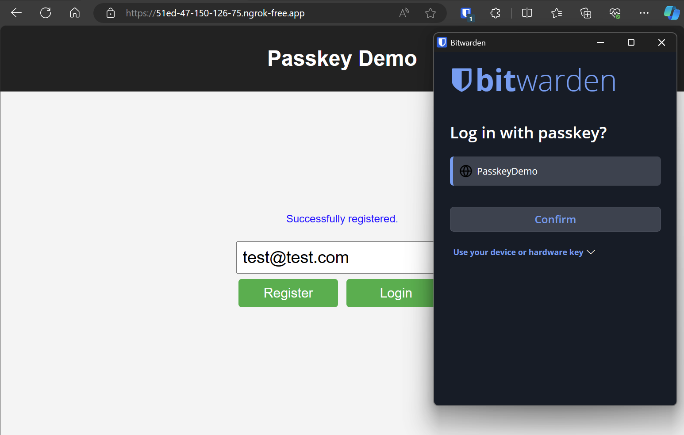

# Passkey Demo

An implementation of authentication with passkeys using the [go-webauthn](https://github.com/go-webauthn/webauthn) library

## Local Setup

Start Postgres and Redis with Docker Compose:

```powershell
docker compose up
```

Setup the database:

```powershell
go run ./db/migration db init
go run ./db/migration db migrate
```

## NGROK

This is to test password managers like bitwarden.  

## Bitwarden Registration



## Bitwarden login


This will create a custom HTTPS url that will route traffic to your your local server.  In this case ```http://localhost:9044```  

```powershell
 ngrok http http://localhost:9044 
 ```

Look for the Forwarding output.  

```powershell
Forwarding      https://51ed-47-150-126-75.ngrok-free.app -> http://localhost:9044        
```

Fix up the .env file.  

```env
RP_DISPLAY_NAME=PasskeyDemo
RP_ID=51ed-47-150-126-75.ngrok-free.app
RP_ORIGIN=https://51ed-47-150-126-75.ngrok-free.app
```

Start the server:

```powershell
go run .
```
